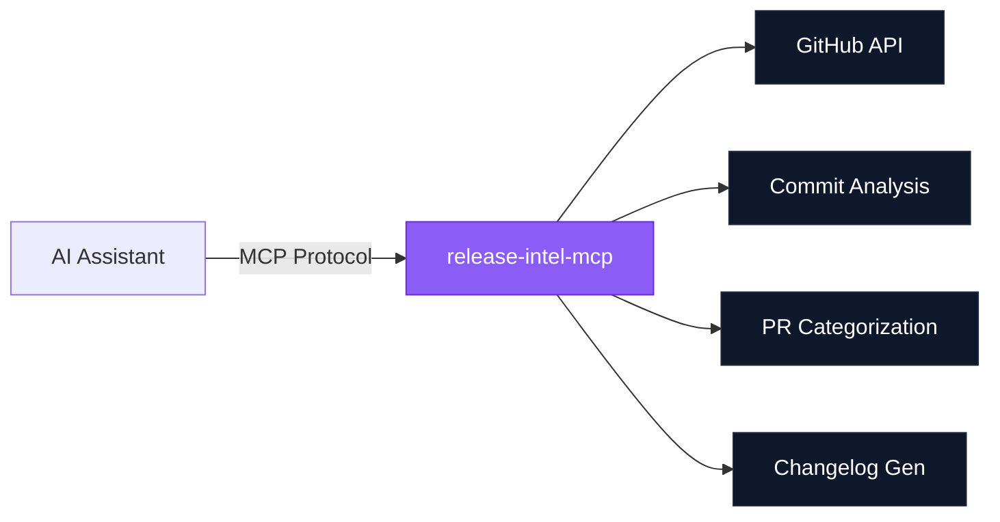

# Intel Suite -- Visual Identity Guide

Reference for maintaining visual consistency across gha-intel-mcp, test-intel-mcp, and release-intel-mcp.

---

## Color Palette

### Shared Foundation

| Role | Hex | Usage |
|------|-----|-------|
| Base Dark | `#0F172A` | Text, dark backgrounds, badge labels |
| Base Medium | `#1E293B` | Secondary dark, borders |
| Base Light | `#F8FAFC` | Light backgrounds, text on dark |
| Neutral | `#64748B` | Muted text, secondary elements |

### gha-intel-mcp -- Amber Signal

| Role | Hex | Tailwind Equivalent |
|------|-----|---------------------|
| Primary | `#F59E0B` | amber-500 |
| Dark | `#D97706` | amber-600 |
| Darker | `#B45309` | amber-700 |
| Darkest | `#92400E` | amber-800 |
| Light | `#FBBF24` | amber-400 |
| Lightest | `#FCD34D` | amber-300 |
| Wash | `#FEF3C7` | amber-100 |
| Background gradient | `#1C1917` to `#44403C` | stone-900 to stone-700 |
| Shields.io badge | `F59E0B` | |

### test-intel-mcp -- Cyan Precision

| Role | Hex | Tailwind Equivalent |
|------|-----|---------------------|
| Primary | `#06B6D4` | cyan-500 |
| Dark | `#0891B2` | cyan-600 |
| Darker | `#0E7490` | cyan-700 |
| Darkest | `#164E63` | cyan-800 |
| Light | `#22D3EE` | cyan-400 |
| Lightest | `#67E8F9` | cyan-300 |
| Wash | `#CFFAFE` | cyan-100 |
| Background gradient | `#0C1222` to `#164E63` | custom to cyan-800 |
| Shields.io badge | `06B6D4` | |

### release-intel-mcp -- Violet Prestige

| Role | Hex | Tailwind Equivalent |
|------|-----|---------------------|
| Primary | `#8B5CF6` | violet-500 |
| Dark | `#7C3AED` | violet-600 |
| Darker | `#6D28D9` | violet-700 |
| Darkest | `#4C1D95` | violet-900 |
| Light | `#A78BFA` | violet-400 |
| Lightest | `#C4B5FD` | violet-300 |
| Wash | `#EDE9FE` | violet-100 |
| Background gradient | `#1E1B4B` to `#4C1D95` | indigo-950 to violet-900 |
| Shields.io badge | `8B5CF6` | |

### CLI Utilities

| Role | Hex | Usage |
|------|-----|-------|
| Utility accent | `#10B981` | emerald-500, all 8 CLI tools |

---

## Logo Marks

### Concept
Faceted hexagons (flat-top orientation) with 6 triangular facets creating a cut-gem/prism effect. Each server has a unique white inner glyph.

### Glyphs
- **gha-intel**: Lightning bolt (CI execution, pipeline speed)
- **test-intel**: Crosshair/scope (precision analysis, coverage targeting)
- **release-intel**: Upward arrow (shipping, release, deployment)

### Files
```
assets/
  logo-gha-intel.svg      # 128x128 amber hexagon + lightning
  logo-test-intel.svg      # 128x128 cyan hexagon + crosshair
  logo-release-intel.svg   # 128x128 violet hexagon + arrow
```

### Sizes
- Full mark: 128x128 (repo icon, docs)
- Medium: 64x64 (inline references)
- Small: 32x32 (badges, favicons)
- Micro: 16x16 (favicon.ico)

All scale cleanly because they are SVG with no fine detail below 16px.

---

## Typography

### In SVG banners (must use system fonts for GitHub rendering)
```
font-family: system-ui, -apple-system, 'Segoe UI', Roboto, Helvetica, Arial, sans-serif
```

### In social preview images (can use web fonts)
```
font-family: 'Inter', system-ui, -apple-system, sans-serif
```
Import: `https://fonts.googleapis.com/css2?family=Inter:wght@400;600;700`

### In READMEs (monospace for code, system for prose)
GitHub handles this automatically via its own stylesheet.

---

## Badges (shields.io)

### Standard badge row for each server

**gha-intel-mcp:**
```markdown
[](https://www.npmjs.com/package/@barissozudogru/gha-intel-mcp)


```

**test-intel-mcp:**
```markdown
[](https://www.npmjs.com/package/@barissozudogru/test-intel-mcp)


```

**release-intel-mcp:**
```markdown
[](https://www.npmjs.com/package/@barissozudogru/release-intel-mcp)


```

---

## Social Preview Images

### Specifications
- Dimensions: 1280 x 640 px (GitHub requirement)
- Format: PNG
- Layout: Left logo + right text, gradient background, dot grid overlay, accent top-line
- Typography: Inter 700 for title (52px), Inter 400 for tagline (20px)

### Generation
```bash
cd assets/
./generate-previews.sh
```

### Upload
GitHub repo > Settings > General > Social Preview > Edit > Upload

---

## README Structure

All three repos should follow this identical structure:

```
1. SVG banner image
2. Badge row (centered, <p align="center">)
3. One-sentence description paragraph
4. "Compatible with:" line
5. Horizontal rule
6. ## Tools (with table for each tool's parameters)
7. Horizontal rule
8. ## Setup (Options A/B/C with client configs)
9. ## Environment Variables (table)
10. ## Local Development (code block)
11. ## License
```

### Banner usage in README
```markdown
<p align="center">
  
</p>
```

---

## Mermaid Diagrams

### Architecture diagram template
````markdown

````

Replace `#8B5CF6`/`#6D28D9` with each server's primary/dark colors.

---

## File Inventory

For each repo, the assets/ directory should contain:

```
assets/
  logo-{name}.svg                    # 128x128 icon mark
  banner-{name}.svg                  # 888x200 README banner
  social-preview-{name}.html         # 1280x640 HTML template
  social-preview-{name}.png          # Generated screenshot
  generate-previews.sh               # Screenshot generation script
```
